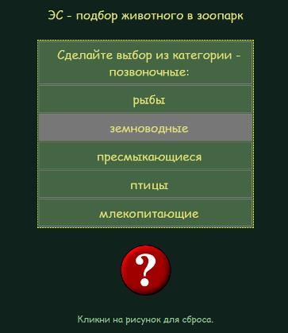
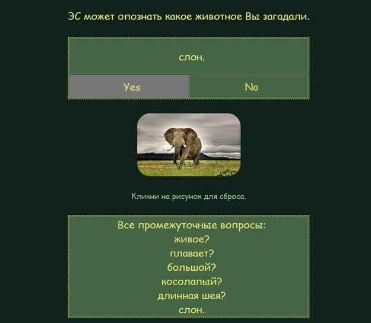
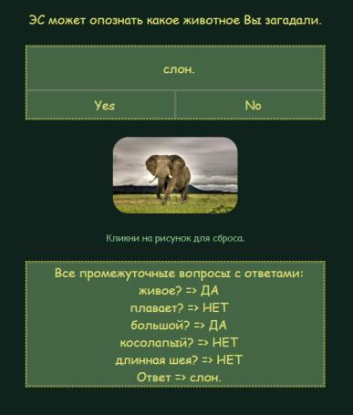

## Курсовой проект

[Методическое пособие по курсовому проектированию](https://pcoding.ru/pdf/CourseProject.pdf)  
Методическое пособие использовать **только для корректного оформления работы** согласно указанных там требований.  
Но содержание работы в этом году другое - нужно разработать Экспертную систему.  

Для оформления также берите в из текущей папки документ с:  
- **Титулом** - это первый лист курсовика, его заполняете Вы;  
- **Рецензией** - это последний лист курсовика, его заполняет преподаватель.  

В курсовике должна быть нумерация страниц, кроме первого листа (Титул) и последнего (Рецензия).  

Итак, тема курсовика - ***Разработка продукционной экспертной системы***.  
Особенности программной реализации:  
- база данных хранится в формате **json** (структура данных словарь - ключ-значение)  
- бизнес-логика (машина вывода) - это просто обработка события выбора из значений ответа на текущий вопрос  
- интерфейс пользователя - веб-страница (без доступа к серверу, только frontend)  

Что вы должны выполнить в рамках Курсового проектирования:  
1) работоспособную программную реализацию (json, html, css, js)  
2) "бумажную" версию отчёта о курсовом проектировании, как описано в Методическом пособии  
3) загрузить на git выполненную программную реализацию и Отчёт о КП в формате *.docx  
--(*при проверках, аккредитации иногда приходится переделывать ваши Отчёты под требования*)  
4) сделать на git'е страничку с вашей реализацией  
--(адрес будет выглядеть примерно так: https://permcoding.github.io/)  
--(то есть имя вашего аккаунта + github.io)  

После сдачи курсовика можете страничку на github.io заменить...  
Чтобы сделать сайт на Гите, достаточно просто создать репозиторий с именем вашаккаунт.github.io, в этом репозитории разместить index.html и другие файлы вашего сайта (htm, css, js), в разделе Settings / Pages на Гите посмотреть настройки и всё...

---  

Желательно в Дереве решений реализовать мультидерево (то есть больше, чем бинарное). И сделать так, чтобы выбор предлагался не только ДА/НЕТ, а в виде списка разных (от 2-х до 6-ти) вариантов, например:  
```txt
Вопрос: какой цвет предпочитаете?  
Варианты ответа:  
- красный  
- зелёный  
- синий  
```

Для манипуляции с объектами DOM'а можно использовать методы нативного js или библиотеки jQuery. Примеры вариантов реализации:  
> 1) бинарное дерево решений  
> > - нативный js: https://pcoding.ru/jsprim/es/es_bin_js/index.html  
> > - jQuery: https://pcoding.ru/jsprim/es/es_bin_jq/index.html  
> 2) мульти дерево решений  
> > - jQuery: https://pcoding.ru/jsprim/es/es_multi_jq/index.html  
> > - нативный js: https://pcoding.ru/jsprim/es/es_multi_js/index.html  

Обрабатываются события и ситуации:  

- выбора одного варианта из нескольких,  
- отказ от выбора (перезагрузка html-страницы),  
- выбор сделан (достигли листка дерева выбора),  
- в базе данных в выбранной категории нет вариантов выбора.  

Примерный вид интерфейса можно оценить тут:  
    

---  

Для оформления можно использовать css-фреймворк Bootstrap.  
Для автоматизации создания интерфейса пользователя можете использовать js-фреймворк vue.js.  

---  

**Предметную область** базы данных выбраете сами.  

Объем реферата 15-20 страниц (листы А4 формата, сброшюрованы).  

1) Титульный лист – 1 стр.,
2) Содержание – 1 стр.,
3) Постановка задачи на проектирование – 1-2 стр.
Следует описать решаемую приложением задачу, можно с иллюстрациями. Следует обосновать выбор технологий для реализации проекта.  
4) Разработка структуры для хранения данных.
Следует описать порядок формирвоания json-файла, поля объекта, почему именно такой выбор и как будет использоваться в веб-приложении. Следует привести соответствующее графическое представление дерева решений (вершины и ветви дерева).  
5) Разработка приложения.  
Разработка интерфейса пользователя. Организация избирательного отображения данных. Настройка внешнего вида отображения необходимых отдельных данных. Примеры программного кода.  
6) Заключение.  
Краткое описание проделанной работы, возможностей и достоинств разработанного приложения, затруднений в использовании технологий и перспектив к его совершенствованию. Возможно итоги проведённых испытаний приложения.  
7) Список литературы – 1 стр.  
8) Приложения – 4-6 стр.
>1. Документ с разметкой страницы index.html  
>2. Стили оформления css  
>3. Структура для хранения данных json  
>4. Текст программы на js  
9) Рецензия  

Примерный вид интерфейса можно оценить тут:  
  
Можете сделать более насыщенный и современный интерфейс.  
Можете в таблицу промежуточных вопросов добавить и соответствующие ответы, например:  

  

---  
---  
