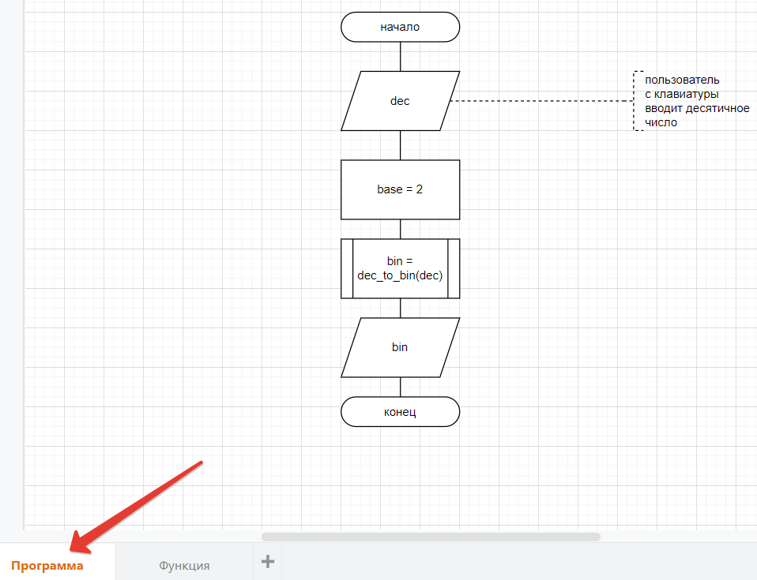
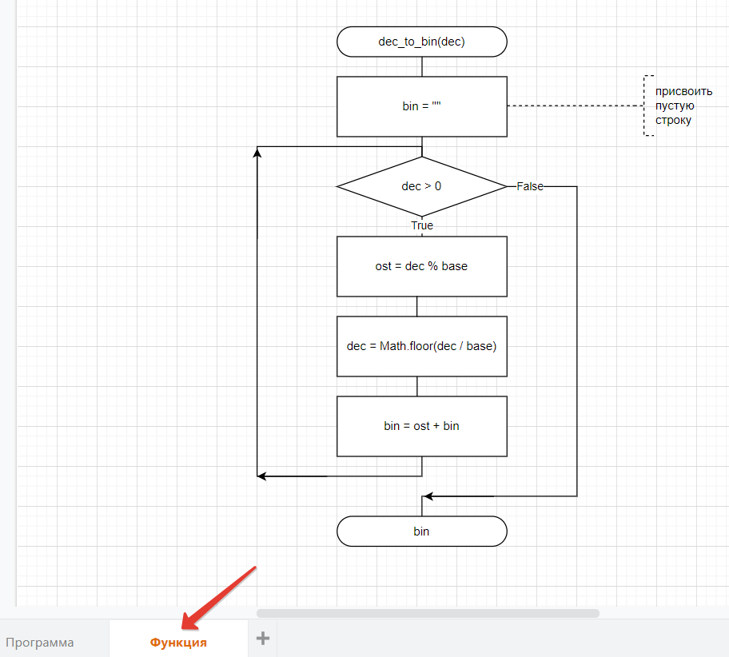

[Пример оформления алгоритма программы и функции](https://drive.google.com/file/d/1lfb2mzKypChtKvTO9MQTv3uQwkV5YtOI/view?usp=sharing)  
При входе сверху нажмите открыть в редакторе diagrams.net  

Кто пропустил Лекцию, можно посмтреть видео-запись про рисование алгоритмов [тут](https://bbb6.psaa.ru/playback/presentation/2.3/5923e2ed02a74e7b4d531d5d9ea23446bfaca0d7-1635143960416).  

---  

  

  

---  

