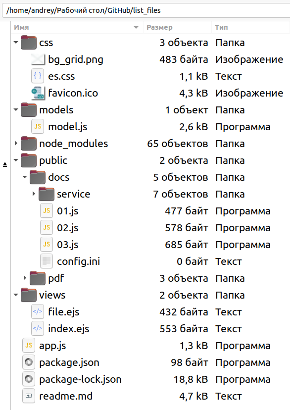
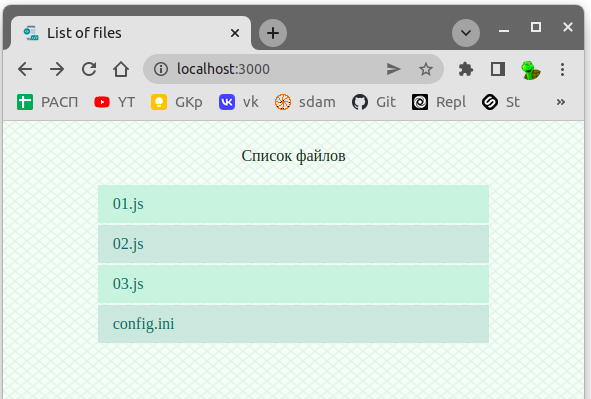
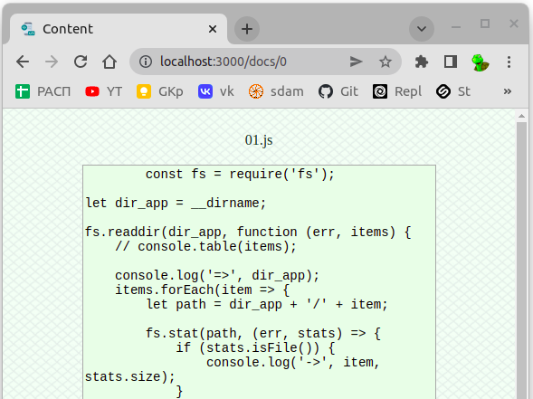

Перед работой установите все нужные зависимости: **npm i**  

- 00-terminal - в этой папке примеры программ, которые в терминале показывают список файлов в текущей папке, или списко файлов во всех поддиректориях указанной папки (для поиска файлов использованы два подхода - рекурсия и очередь)  
- 01-browser - в этой папке примеры программ, которые на клиенте показывают таблицу со списком файлов с сервера, при нажании на имя файла можно посмотреть содержимое или загрузить к себе  
- 02-upload - в этой папке примеры программ, которые позволяют в браузере выбрать файл на компе клиента и загрузить на сервер  

---  

**MVC** - паттерн (Model-View-Controller)  

Паттерн - это шаблон построения архитектуры приложения.

---  

**model** - модель - это часть архитектуры приложения:  

- включает в себя бизнес-логику приложения (классы, методы, функции обработки данных);  
- модель "не знает" о контроллерах и представлениях, не ориентируется на них;  
- данные модели могут быть представлены таблицами базы данных или файлами XML, JSON, csv;  
- это может быть просто набор объектов или функций для реализации логика приложения.  

---  

**view** - представление - это часть архитектуры приложения:

- отвечает за визуальное отображение данных, полученных от модели  
- представление может читать данные, но не может записывать или изменять их  
- представление может иметь программный код, который реализует логику отображения данных  

Примеры представления: HTML-страница, WPF форма, Windows Form.  

---  

**controller** - контроллер - это часть архитектуры приложения:  
- совокупность обработчиков событий представления  
- принимает события от представления  
- отдаёт событие на обработку в модель  
- возвращает пользователю обновлённое представление  
- или выбирает какое именно представление должно быть отображено в ответ  

---  

[Статья: MVC vs MVP vs MVVM](https://habr.com/ru/post/215605/)

---  

```
```

**ЗАДАНИЯ ДЛЯ ЛАБОРАТОРНОЙ РАБОТЫ**  

Сделать web-приложение на nodejs+express, которое при запуске показывает в браузере таблицу со списком файлов из указанной папки, включая и все её поддиректории, а при нажании на имя файла можно посмотреть его содержимое или загрузить к себе.  


**Список и расположение файлов приложения:**  
  
**Окно для отображения списка файлов:**  
  
**Окно для отображения содержимого файла:**  
  

Сделать доработки в приложении:
- Приложение должно отображать файлы не только указанной директории, но и всех её поддиректорий.    
- Добавить в таблицу колонку с кнопкой/гиперссылкой **ЗАГРУЗИТЬ**, чтобы появилась возможность у пользователя загружать файл (а не только просматривать).  
- Сейчас все файлы из всех поддиректорий в представлении отображаются общим списком, без разделения на директории. Кроме того, в разных директориях могут встретиться файлы с одинаковыми именами и в данном варианте реализации в представлении их никак не отличить. Требуется изменить представление так, чтобы в таблице со списком файлов отображалась дополнительная информация - в отдельных столбцах, директория (относительный путь) и размер файла (всего будет три колонки в таблице).  
- Сделать возможность фильтрации файлов - то есть чтобы у пользователя была возможность выбрать файлы только определённого расширения, например, только ini, csv, js, ... (в представлении можно просто над таблицей добавить соответствующие интерактивные кнопки или гиперссылки - с надписями ini, csv, js).  
- Добавить возможность сортировки файлов в таблице по возрастанию на выбор: по размеру или по имени. (в представлении можно просто добавить шапку таблицы с названиями столбцов и сделать интерактивными кнопки или гиперссылки в колонке Имя файла и Размер файла).  

---  

```js
// так можно получить имя файла без пути:  
path.basename(file_path_name);  
```
