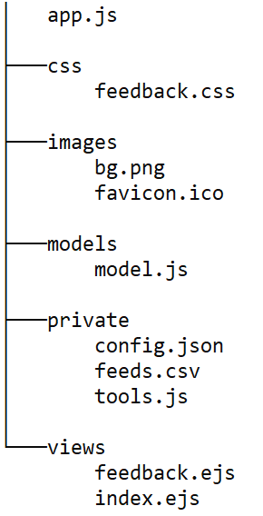

# Проект

## web-приложение "Отзывы на продукт"

**Технологии:**  

- Nodejs
- Express
- ejs
- MVC
- csv
- json
- re
- SQLite
- html
- css
- lodash  

Используется паттерн проектирования MVC.  

**Дерево директорий приложения:**  



При наличии файла **package.json** можно установить необходимые зависимости:  

```txt
npm i
```

Содержимое файла **package.json** при хранении данных в csv-файле (без БД SQLite):

```js
{
  "dependencies": {
    "csvjson": "^5.1.0",
    "ejs": "^3.1.6",
    "express": "^4.17.3"
  }
}
```

Либо каждую из зависимостей установить отдельно:  

```js
npm i csvjson
npm i ejs
npm i express
```

При использовании БД SQLite (вместо хранения данных в csv-файле) можно установить одну из этих библиотек:  

```js
npm i sqlite-sync
npm i sqlite3
```

Запуск приложения:  

```js
node app
```

После запуска можно в браузере увидеть главную форму приложения, перейдя по адресу:  

```txt
localhost:3000/
```

Главная форма приложения:  
  

Дочерняя форма приложения для отзывов:  
  

---  

### Задания для самостоятельного исполнения  

- добавить поле "Оценка продукта" (добавить отдельный, самый правый столбец таблицы)  
- разделить поля дата и время (на отдельные столбцы таблицы)  
- добавить возможность сортировки отзывов на главной странице приложения по убыванию: по оценке, по дате - при нажатии на соответсвующий столбец происходит сортировка по этому полю по убыванию (после сортировки по дате вверху списка окажутся самые новые отзывы, после сортировки по оценке вверху списка окажутся отзывы с высокими оценками)  
- изменить на свой вкус дизайн фона, кнопок, шрифтов, цветовое оформление...  

---  
